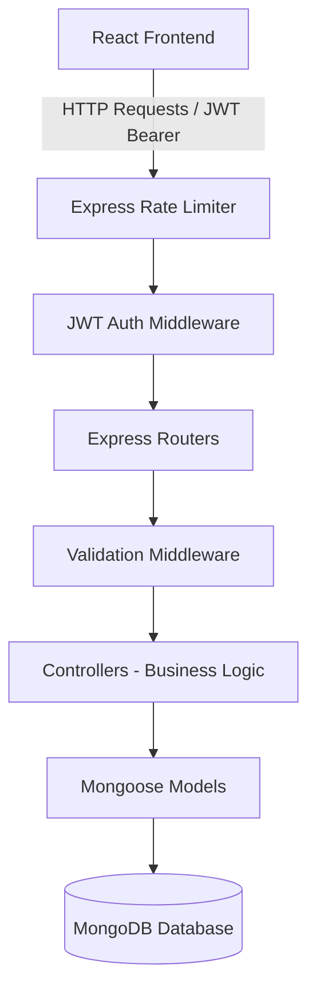

# Interview Preparation Guide - User Management System (MERN Stack)

This guide contains a comprehensive code walkthrough, design pattern explanations, and potential interview questions with detailed answers to help you prepare for full-stack developer interviews.

---

## 🏗️ 1. System Architecture & Design Choices

The application uses a **layered architecture** which segregates duties cleanly between client and server.



### Core Technologies
1. **Node.js & Express.js**: Lightweight and fast backend runtime and framework. Uses **ES modules (`import/export`)** to comply with modern JS standards.
2. **MongoDB & Mongoose**: Mongoose acts as an ODM (Object Document Mapper) providing schema validations, query middleware (hooks), and helper methods.
3. **React (Vite SPA)**: Vite compiles extremely quickly. We use the **Context API** for lightweight global state (Auth, Theme, Toasts) avoiding unnecessary Redux boilerplate.

---

## 🔒 2. Backend Coding & Architecture Explanations

### A. Mongoose User Model with Hook Hooks
**File:** [User.js](file:///c:/Users/HP/Desktop/usermanagment/server/models/User.js)

#### Code Highlight:
```javascript
// Hashing passwords pre-save
userSchema.pre('save', async function (next) {
  if (!this.isModified('password')) return next();
  try {
    const salt = await bcrypt.genSalt(10);
    this.password = await bcrypt.hash(this.password, salt);
    next();
  } catch (error) {
    next(error);
  }
});
```
* **Why it matters**: Hashing is one-way. We use `bcryptjs` with a salt factor of 10. Salting adds random data to the password input to prevent rainbow table attacks.
* **Pre-save hook**: Automatically intercepts any save operation and hashes the password if it was modified or newly created.

---

### B. JWT Authentication & Role-Based Access Control (RBAC)
**File:** [auth.js](file:///c:/Users/HP/Desktop/usermanagment/server/middleware/auth.js)

#### Middleware Logic:
```javascript
export const protect = async (req, res, next) => {
  let token;
  if (req.headers.authorization && req.headers.authorization.startsWith('Bearer')) {
    try {
      token = req.headers.authorization.split(' ')[1];
      const decoded = jwt.verify(token, process.env.JWT_SECRET);
      req.user = await User.findById(decoded.id).select('-password');
      if (req.user.status === 'Inactive') {
        return res.status(403).json({ message: 'User account is inactive.' });
      }
      next();
    } catch (error) {
      return res.status(401).json({ message: 'Not authorized, token failed' });
    }
  }
  // ...
};

export const authorize = (...roles) => {
  return (req, res, next) => {
    if (!roles.includes(req.user.role)) {
      return res.status(403).json({ message: 'Role not authorized' });
    }
    next();
  };
};
```
* **Stateless Auth**: The token is signed using `jsonwebtoken` on the server and sent to the client. The client attaches it to the `Authorization` header as `Bearer <token>` for subsequent requests.
* **RBAC Guarding**: `authorize('Admin', 'Manager')` returns a middleware closure. It inspects `req.user.role` (populated by `protect`) and blocks execution if the role isn't authorized.

---

### C. Dashboard Metrics (Aggregation Pipeline)
**File:** [userController.js](file:///c:/Users/HP/Desktop/usermanagment/server/controllers/userController.js)

#### Code Highlight:
```javascript
const departmentStats = await User.aggregate([
  {
    $group: {
      _id: '$department',
      count: { $sum: 1 }
    }
  },
  { $sort: { count: -1 } }
]);
```
* **Aggregation**: Instead of loading all users to count them in JavaScript (which crashes for large datasets), MongoDB aggregates them directly in the database.
* **`$group`**: Groups documents by their `department` field and accumulates count via `$sum: 1`.

---

## 🎨 3. Frontend Architecture Explanations

### A. Context API State Flow
We wrap components in Context Providers to make them accessible without **prop drilling**.

**AuthContext.jsx** handles login requests, holds the current user state, and interceptor hooks.
**ThemeContext.jsx** modifies the DOM:
```javascript
useEffect(() => {
  const root = document.documentElement;
  if (theme === 'dark') {
    root.classList.add('dark');
  } else {
    root.classList.add('light');
  }
}, [theme]);
```
* By applying `dark` or `light` classes to the `html` element, CSS selectors can automatically switch variables (e.g. `--bg-card` changes from `#ffffff` to `#1e293b`).

---

## 💬 4. Commonly Asked Technical Interview Questions

### Q1: What is the difference between encryption, hashing, and salting?
* **Encryption**: A two-way function where data is scrambled using an encryption key, and can be decrypted later using the corresponding decryption key (e.g., AES).
* **Hashing**: A one-way function that takes an input and produces a fixed-length string of characters (the hash). You cannot reverse a hash to get the original input (e.g., SHA-256).
* **Salting**: Adding a unique, random string of characters (a salt) to a password before hashing it. This ensures that two users with the same password will have completely different hashes, protecting against rainbow table (pre-computed hash) attacks.

---

### Q2: What is JWT? Explain its structure and how it works.
* **JWT (JSON Web Token)** is an open standard (RFC 7519) that defines a compact and self-contained way for securely transmitting information between parties as a JSON object.
* **Structure**: Composed of three parts separated by dots (`.`):
  1. **Header**: Specifies the token type (JWT) and the signing algorithm (e.g., HS256).
  2. **Payload**: Contains the claims (user data, token expiry, etc.). Do not store sensitive info (like passwords) here as this part is base64-encoded, not encrypted.
  3. **Signature**: Created by signing the encoded header, payload, and a secret key using the specified algorithm. This verifies that the sender is who they say they are and ensures the message wasn't altered.
* **Workflow**: User logs in -> Server validates credentials -> Server signs JWT and returns it -> Client saves JWT (e.g., in localStorage) -> Client sends JWT in the `Authorization` header for protected API calls -> Server verifies signature and grants access.

---

### Q3: Why did you use `localStorage` instead of `HttpOnly cookies` for storing JWTs? What are the security trade-offs?
* **localStorage**:
  * *Pros*: Extremely easy to implement in SPAs. No issues with cross-domain requests.
  * *Cons*: Vulnerable to **XSS (Cross-Site Scripting)** attacks. If a hacker injects a malicious script, they can read `localStorage.getItem('token')`.
* **HttpOnly Cookies**:
  * *Pros*: Protected from XSS because JavaScript cannot read cookie headers with the `HttpOnly` flag enabled.
  * *Cons*: Vulnerable to **CSRF (Cross-Site Request Forgery)** attacks. Requires CSRF protection tokens to secure requests.

---

### Q4: How do you handle search, sorting, filtering, and pagination at scale?
* You should **never** do pagination, searching, or filtering on the frontend in enterprise systems. If the database has 100,000 users, sending all of them to the browser will freeze the client.
* **Backend Pagination**: Use query parameters `page` and `limit`. In MongoDB:
  ```javascript
  const skip = (page - 1) * limit;
  const users = await User.find(query).skip(skip).limit(limit);
  ```
* **Backend Search**: Use regex searches on indexed fields (or text indexes for full-text search):
  ```javascript
  query.email = { $regex: searchString, $options: 'i' };
  ```
* **Indexes**: Always ensure that fields used for searches and sorting (like `email`, `role`, `createdAt`) are indexed in MongoDB to prevent slow collection scans.

---

### Q5: How do you handle centralized errors in Express?
* Express has a built-in error handling mechanism. If you pass an error to `next(error)`, Express bypasses all normal middleware and jumps straight to the custom error middleware:
  ```javascript
  // Centralized middleware signature: must have exactly 4 arguments
  app.use((err, req, res, next) => {
    res.status(err.status || 500).json({ message: err.message });
  });
  ```
* This allows you to write clean controller methods without writing repetitive `res.status(500).json(...)` blocks. You catch errors in a `try/catch` and pass them down with `next(error)`.

---

### Q6: What is a rate limiter and why is it important?
* A rate limiter restricts the number of requests a client can make to an API within a given timeframe (e.g., maximum 100 requests per 15 minutes).
* It protects the system from:
  1. **DDoS Attacks (Distributed Denial of Service)**: Flooding the server with traffic.
  2. **Brute Force Attacks**: Automated scripts trying thousands of passwords on `/api/auth/login`.
  3. **Resource Starvation**: Users running expensive search scripts continuously.
* We implemented this using `express-rate-limit` middleware at the `/api` route.

---

### Q7: Explain the difference between React's Context API and Redux.
* **Context API**: Built-in React feature. Best for low-frequency global updates (e.g., language selection, user authentication, or theme toggling). It is simpler to set up but triggers a re-render of all consumer components whenever the state changes.
* **Redux**: A third-party state management library. Best for high-frequency, complex state updates. It optimizes re-renders using a selector pattern and supports middleware (like Redux Thunk or Saga) for side effects and structured debugging tools (Redux DevTools).

---

## 💡 Top Interview Tips to Get Placed
1. **Understand your code inside out**: Be ready to explain exactly what `bcrypt.compare` does, why `jwt.sign` requires a secret, and how routing protection works.
2. **Focus on security**: Interviewers love candidates who understand rate limiting, CORS configuration, HTTP-only cookies, input sanitization, and password safety.
3. **Aggregations and Indexing**: Mentioning Mongoose aggregation pipelines and indexing search query fields shows that you write production-ready code.
4. **Use terms like "Stateless" and "Layered Architecture"**: Using professional architectural vocabulary immediately distinguishes you from junior developers.
